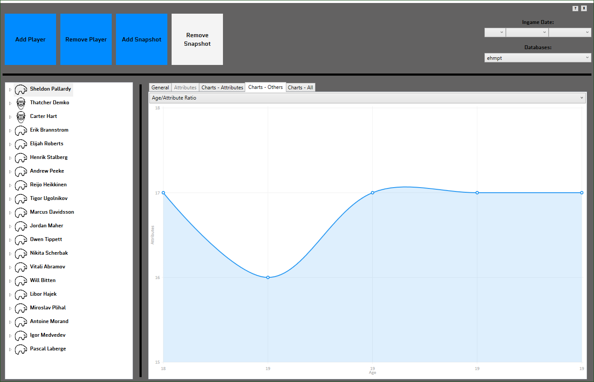

# **[Download here](https://github.com/Gabisonfire/ehmpt/releases/download/0.1Beta/EHMpt.zip)**

# EHMProgressTracker

EHMpt is a utility to track your players progress and display useful information in forms of graph.

# Using it
- Unzip the archive and run "EHMProgressTracker.exe"
- The default height and width can be modified by editing ehmpt.config
- You can preset the ingame date in the top right corner so you don't have to input it every time.
- Add a player and enter his initial stats. This will create his first snapshot. When later in your game, select the player in the treeview on the left and add a "snapshot" to that player. These will be used for comparison and charts.
- Different tabs will unlock whether you select a player or a snapshot in the treeview.
- You can add a different database by chosing "New..." from the database drop-down if you want to seperate players.

# Roadmap
- Track Height / Weight
- Treeview sorting options 
- More attributes compare
- More options
- Custom formulas
